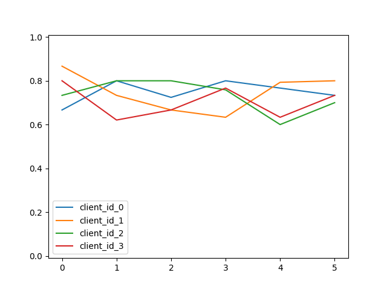

# Sleep Score Prediction Using Federated Learning

## Overview

This project aims to explore the factors influencing FitBit sleep scores and understand how to achieve a sleep score of 80 or more. The dataset used in this analysis comprises 8,522 samples from 4 users.

## Sleep Score Components

According to FitBit, the sleep score is determined by three main components:

1. **Duration:** Reflects the time spent asleep and awake. More sleep contributes to a higher score.

2. **Quality:** Takes into account the time spent in deep and REM sleep. More time in these sleep stages leads to a higher score.

3. **Restoration:** Considers factors such as sleeping heart rate and restlessness. A more relaxed sleep results in a higher score.

## Sleep Score Ranges

- **Excellent:** 90-100
- **Good:** 80-89
- **Fair:** 60-79
- **Poor:** Less than 60

## Dataset Split

To create training samples for clients and validation samples on the server side, a split of 70:30 has been applied. Additionally, an 80:20 split has been made on the training samples of clients for training and testing on each client.

## Results

The implementation of Federated Averaging resulted in the following observations:

- The use of Federated Averaging reduced accuracy by 4.06% from the centralized apporach and led to an increase in loss by 0.32.
- These results indicate the substantial impact of federated learning in converging models in a distributed-privacy-conserving fashion.
- Detailed client-specific results are presented in Table 1, and the learning progression is visualized in Figure 1.

### Figure 1

*Figure 1 shows the progression of accuracy for individual clients after each aggregation. The image provides a clear visualization of the model's learnable capacity.*

### Table 1

*Table 1 displays the performance of different clients throughout the learning process. It includes client-wise accuracy and loss values after each aggregation step.*

